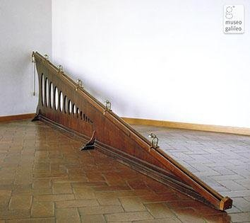

*Réponse publiée [sur Quora](https://fr.quora.com/Comment-Galil%C3%A9e-a-t-il-trouv%C3%A9-la-valeur-98/answer/Dr-Goulu)*

[Galilée (1564–1642)](w:Galilée_(savant))n'avait aucun moyen de mesurer g, même approximativement, car il n'avait pas de chronomètre assez précis. Il a "juste" déterminé qu'un objet en chute libre accélérait de façon constante, donc que sa position varie comme le carré du temps. Pour ça il a fait rouler une bille sur un plan incliné muni de clochettes et déplacé les clochettes jusqu'à ce qu'elles produisent un tintement régulier, plus ou moins détectable à l'oreille :

[Les expériences de Galilée - La physique au temps de Newton • Tutoriels • Zeste de Savoir](https://zestedesavoir.com/tutoriels/614/la-physique-au-temps-de-newton/383_la-chute-des-corps/1959_les-experiences-de-galilee/)

Je n'arrive (étonnamment) pas à trouver qui a obtenu la première mesure à peu près correcte de g, mais je pense que c'est [Christian Huygens](w:) en 1659, lorsqu'il a déterminé que la période d'un pendule de longueur $l$ était $T=2\pi\sqrt{l/g}$

Un pendule permet de faire la mesure sur un jour complet donc avec une mesure du temps très précise.

En tout cas c'est comme ça que [Jean Richer](w:)a montré en 1672 que le même pendule bat plus lentement à Cayenne qu'à Paris, ce qui confirme une hypothèse de Huygens sur l'effet de la rotation de la Terre sur g. Et cet effet correspond approximativement à la deuxième décimale, 9.80 au lieu de 9.81, donc sa mesure avait déjà une précision de l'ordre du millième…
