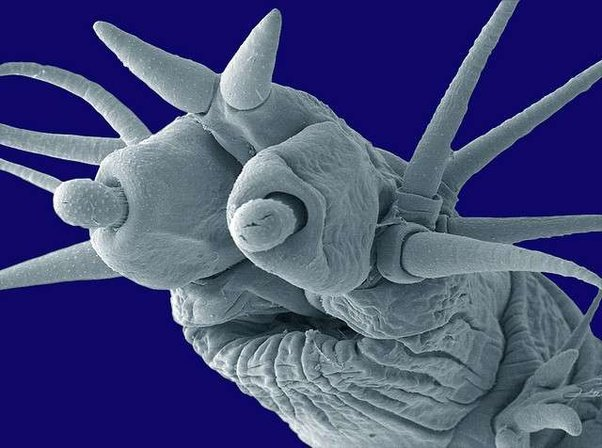

*Réponse publiée [sur Quora](https://fr.quora.com/Quel-%C3%AAtre-vivant-semble-sortir-d-un-film-de-science-fiction-quand-on-le-regarde-avec-un-microscope/answer/Dr-Goulu)*

Tous. D'ailleurs c'est souvent comme ça qu'on imagine les créatures de science-fiction…

Aucune créature microscopique ne ressemble (beaucoup) à un animal macroscopique, parce que les contraintes de l'environnement sont totalement différentes.

(ver sous-marin grossi 525 fois par un microscope électronique. © Philippe Crassous, FEI, Flickr)
