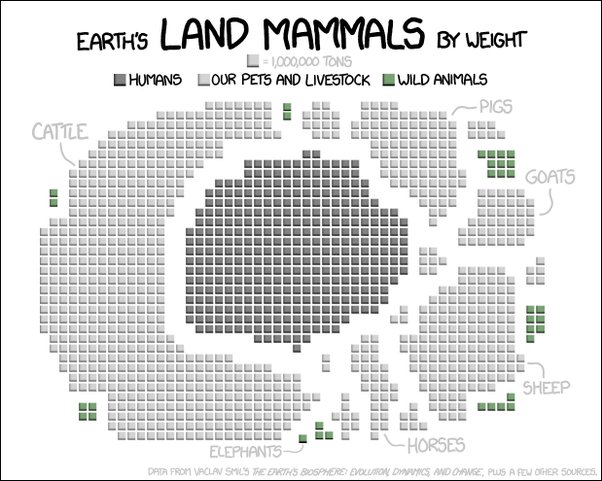

*Réponse publiée [sur Quora](https://fr.quora.com/Pourquoi-l-%C3%A9levage-des-bovins-consomme-t-il-autant-de-ressources-alors-que-dans-la-nature-ils-se-contentent-juste-d-herbe-que-nous-ne-pouvons-pas-manger/answer/Dr-Goulu)*

La réponse en un seul dessin de [XKCD:](https://xkcd.com/1338/)

Nous avons élevé des (centaines c'est exagéré) dizaines de fois plus de bovins qu'il n'y en a dans la nature. Nous avons défiché des milliers de kilomètres carrés de forêt et irrigué et cultivé d'immenses prairies pour eux. Ou plutôt pour les bouffer ensuite.
