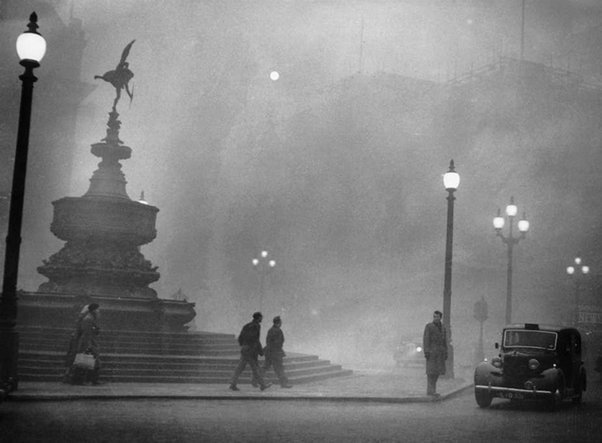

*Réponse publiée [sur Quora](https://fr.quora.com/Pourquoi-nous-nutilisons-nous-plus-la-machine-%C3%A0-vapeur-si-elle-ne-rejette-pas-de-CO2/answer/Dr-Goulu)*

Et pour chauffer l'eau pour en faire de la vapeur, on utilisait quoi déjà ?

La mémoire humaine est géniale : on a déjà oublié que le [Smog](w:)recouvrait nos villes il y a quelques décennies, causant des milliers de morts par asthme….

(Piccadilly Circus plongé dans le « [Grand smog de Londres](w:)» en 1952. Wikipédia, CC BY.
Je pense que la petite lumière dans le ciel est le Soleil…)

L'avantage indiscutable du charbon, c'est que les émissions de CO2 sont le cadet des soucis quand la suie recouvre tout, exposant la population à une radioactivité (sisi…) nettement supérieure à celle due à l'industrie nucléaire. Sans compter les milliers de morts par an dans les mines, évidemment.

Ah, le bon vieux temps …
