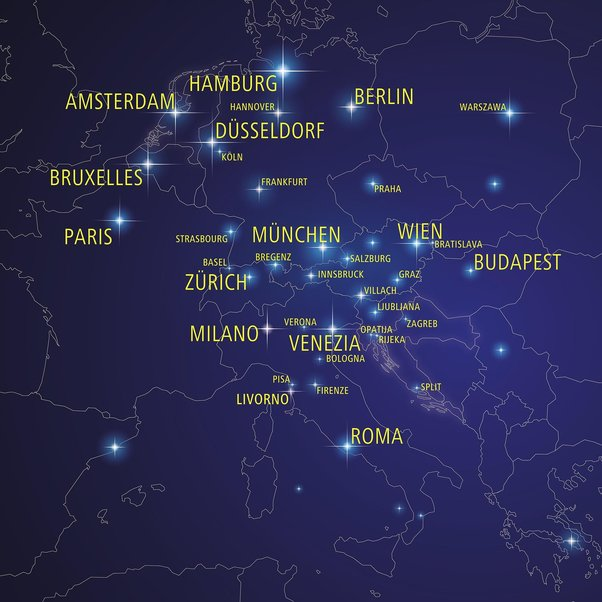

*Réponse publiée [sur Quora](https://fr.quora.com/Pourquoi-n-y-a-t-il-plus-de-trains-de-nuit/answer/Dr-Goulu)*

Il y en a de nouveau,, et ils sont bondés, archipleins, il faut les réserver des semaines à l'avance.

Ce sont les chemins de fer autrichiens, les ÖBB qui ont racheté les wagons et les lignes et desservent toute l'Europe. Bon surtout à l est de la France…

[https://www.nightjet.com/fr/reis...](https://www.nightjet.com/fr/reiseziele)
