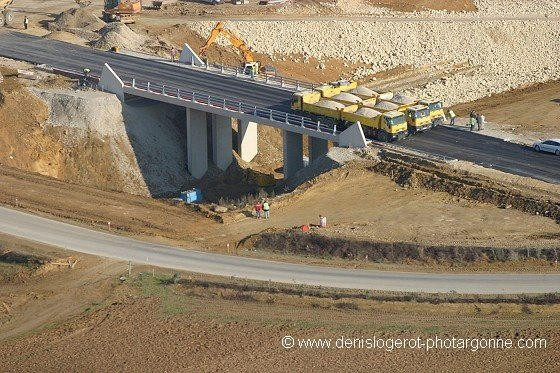
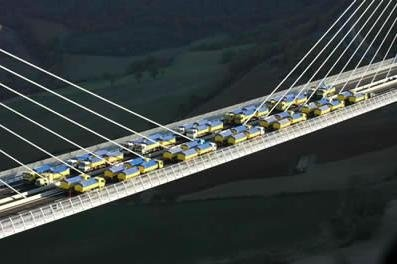
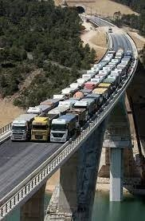

*Réponse publiée [sur Quora](https://fr.quora.com/Comment-la-charge-maximale-d-un-pont-est-elle-d%C3%A9termin%C3%A9e/answer/Dr-Goulu)*

Elle est spécifiée dans le cahier des charges du pont, qui est calculé pour.

Une fois construit, le pont est testé sous différents "cas de charge" avec des camions disposés des pires manières possibles

Mon père qui a conçu et construit de nombreux ponts comme ingénieur m'a dit qu'il avait toujours une boule au ventre en pensant aux chauffeurs lors des tests de charge…
