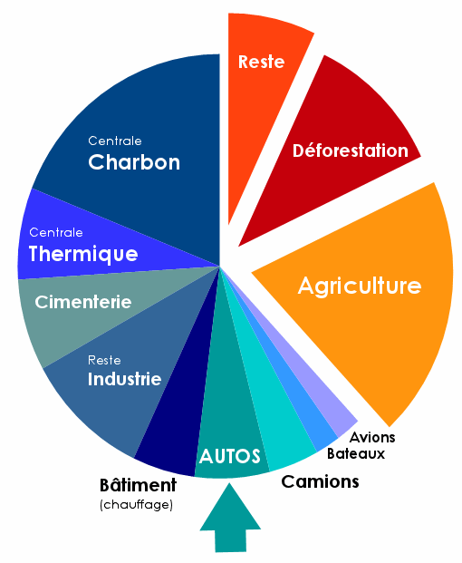

*Réponse publiée [sur Quora](https://fr.quora.com/Quelle-est-la-responsabilit%C3%A9-exacte-des-v%C3%A9hicules-thermiques-dans-les-%C3%A9missions-de-CO2/answer/Dr-Goulu)*

Entre 6% et 9% (greenpeace)

