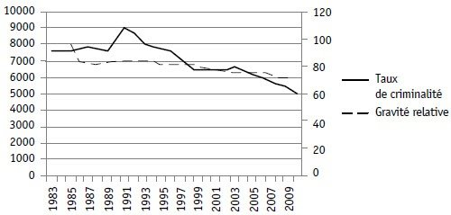

*Réponse publiée [sur Quora](https://fr.quora.com/Comment-le-show-business-a-t-il-rendu-notre-soci%C3%A9t%C3%A9-plus-violente/answer/Dr-Goulu)*

commencez par prouver que "notre" (laquelle?) société est devenue plus violente, on discutera après.

Au Canada ça n'a pas l'air d'être le cas :

Source : Centre canadien de la statistique juridique (Statistique Canada)

[Une mesure de la gravité moyenne des crimes enregistrés par la police – Criminologie](https://www.erudit.org/fr/revues/crimino/2013-v46-n2-crimino01046/1020994ar/)
