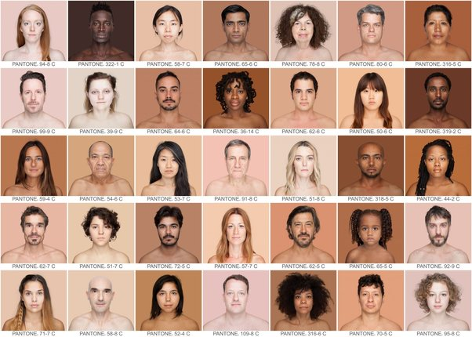

*Réponse publiée [sur Quora](https://fr.quora.com/Quels-sont-les-singes-les-plus-%C3%A9tonnants/answer/Dr-Goulu)*

Homo Sapiens, sans hésitation.

Sa diversité de comportements ne cesse de m'étonner.

( [Humanae — Angélica Dass](https://angelicadass.com/photography/humanae/) )
