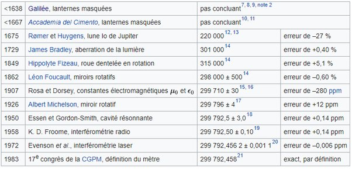

*Réponse publiée [sur Quora](https://fr.quora.com/Comment-avons-nous-mesur%C3%A9-la-vitesse-de-la-lumi%C3%A8re/answer/Dr-Goulu)*

On l'a mesurée de différentes manières au cours de l'histoire, en améliorant chaque fois la précision.

(source : [Vitesse de la lumière — Wikipédia](w:Vitesse_de_la_lumière) cliquez sur ce lien puis sur les liens pour avoir les détails de chaque méthode)

Comme vous le voyez, en 1983 il s'est passé quelque chose de spécial : la mesure de la vitesse de la lumière est devenue aussi précise que celle du mètre. On ne peut pas faire de mesure encore plus précise car on ne sait pas fabriquer un mètre assez précis. Alors on a fait l'inverse : on a fixé la vitesse de la lumière, et dit que le mètre vaut la distance parcourue par la lumière en 1/299792458 ème de seconde.

Donc maintenant on ne peut plus mesurer la vitesse de la lumière en divisant une longueur par un temps on ne peut que mesurer une longueur en multipliant un temps par la vitesse de la lumière.

Et c'est d'ailleurs un truc que j'ai appris sur Quora il y a environ 5 ans:

[https://www.drgoulu.com/2017/05/...](/2017/05/26/pourquoi-on-ne-peut-plus-mesurer-la-vitesse-de-la-lumiere/#.Yv_q0HaiGCo)
