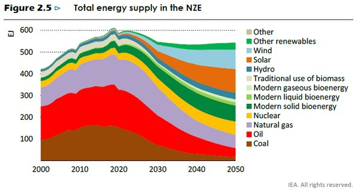

*Réponse publiée [sur Quora](https://fr.quora.com/Pourquoi-ne-recouvre-t-on-pas-un-d%C3%A9sert-de-panneaux-photovolta%C3%AFques-Selon-certains-articles-il-suffirait-d1-de-la-surface-du-Sahara-pour-avoir-toute-l%C3%A9nergie-dont-on-a-besoin/answer/Dr-Goulu)*

Ouaip, yaka faucon …

D'abord, le Sahara c'est grand : 8,5 millions de km2

Il faudrait y mettre 85'000 km2 de panneaux d'accord ?

D'après le site ci-dessous, ça produirait 23 500 TWh de production annuelle d’électricité solaire, ce qui représenterait environ 20'000 GWc de capacité installée.

En 2020, on a installé dans le monde 138,2 GWc, donc les 20'000 GWc **représentent 144 ans de production de panneaux solaires**. Bon, on pourrait imaginer multiplier cette production par 5 pour arriver à le faire en 30 ans.

Outre le fait que ça consommera un tiers du verre mondial, 14% du cuivre et 19% du silicium, prévoyez aussi plus d'**un milliard de tonnes de béton** pour éviter que vos panneaux ne s'envolent dans le simoun

[https://techniquesolaire.com/avi...](https://techniquesolaire.com/avis-dexpert/deploiement-mondial-de-lenergie-solaire-et-consommation-de-matieres-premieres-et-despace/)

Bon voilà, cool, vous avez une installation qui produit 20'000 GW à midi, il vous faut des lignes électriques THT (très haute tension) qui amènent ce jus chez vous.

Actuellement, les lignes les plus puissantes existant chez nous transportent environ 1GW, mais il y a des lignes à 6GW en Chine et on pense pouvoir faire des lignes de 10GW en courant continu un jour [[1]](#pCxVk)

Donc vous devez **construire 2000 lignes électriques de plusieurs milliers de km de long** à travers de pays qui ne sont pas forcément vos copains, et traverser des bras de mer.

Et la nuit ? soit vous inventez un système de science fiction pour stocker de pareilles quantités d'électricité, soit vous répartissez vos panneaux sur les déserts tout autour de la Terre : Sahara, Gobi, Atacama, Amazonie … et vous faites des câbles transocéaniques pour transporter le jus, qui sont aussi de la pure science-fiction.

Dans toute l'histoire, vous vous contre-fichez des gens (comme moi) et animaux qui aiment le désert, y vivent, et ne vont pas aimer crever de soif à côté des pipelines d'eau qu'il faudra pour nettoyer les panneaux après les tempêtes de sable.

Et je termine par un tout léger bémol à la phrase "il suffirait d'1% de la surface du Sahara pour avoir toute l'énergie dont on a besoin" parce qu'en fait, ce chiffre ne correspond qu'à l'électricité que l'on produit actuellement. Si on veut remplacer des énergies fossiles, il en faut en réalité 4 à 5 fois plus …

Comme le montre le graphique ci-dessous qui correspond au scenario "Net Zero Emissions 2050" de l’Agence Internationale de l’Energie, ce dont on a parlé plus haut ne correspond qu'à la courbe orange.

Il faut faire environ autant d'éolien (avec des difficultés similaires), et de biomasse, et augmenter le nucléaire quand même …

Notes de bas de page

[[1]](#cite-pCxVk)[La Chine adopte l’ultra-haute-tension pour optimiser le transport de l’électricité](https://am.pictet/fr/france/mega/chine-le-courant-continu-a-ultra-haute-tension)
