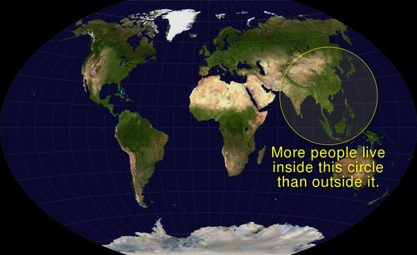

*Réponse publiée [sur Quora](https://fr.quora.com/Nous-savons-que-l%C3%A9nergie-nest-pas-vraiment-un-probl%C3%A8me-cest-surtout-les-transports-et-ce-quils-permettent-le-vrai-probl%C3%A8me-Tenons-nous-donc-%C3%A0-ce-point-%C3%A0-notre-confort/answer/Dr-Goulu)*

les transports ne représentent "que" 29% de la consommation d'énergie, soit autant que l'industrie, et un peu plus que le résidentiel (éclairage, chauffage, électroménager…) qui en utilise 21%, le secteur tertiaire (bureaux, telecommunications) 8%

[https://fr.wikipedia.org/wiki/Re...](w:Ressources_et_consommation_énergétiques_mondiales)

Le problème est donc qu'il n'y a pas qu'un problème, mais 3 d'importance comparable.

Peut-être bien que les gentils bobos écolos des pays riches sont prêts à quelques sacrifices sur leur confort, mais il faut aussi penser au milliard de chinois qui sont en train de sortir de la misère, suivis de près par le milliard d'indiens et le milliard d'africains qui suivra.

N'oubliez pas que si les humains vivaient tous en démocratie, la majorité serait dans ce cercle :

