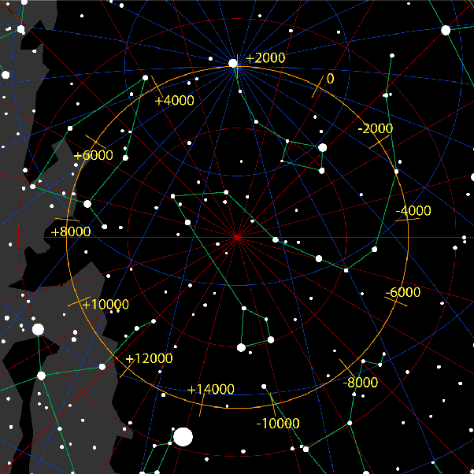

*Réponse publiée [sur Quora](https://fr.quora.com/Comment-l-axe-de-la-Terre-peut-il-rester-centr%C3%A9-sur-Polaris-pendant-que-la-Terre-tourne-dans-trois-directions-diff%C3%A9rentes/answer/Dr-Goulu)*

Il n'est aligné que très approximativement.

[Alpha Ursae Minoris](w:)a une déclinaison de +89° 15′ 50,79, donc elle est à 3/4 de degrés du prolongement de l'axe de la Terre, soit plus du diamètre apparent de la Lune.

De plus cet angle varie de 7. 54' (minutes d'arc) pendant l'année en raison de la [Parallaxe](w:).

Enfin, la [Précession des équinoxes](w:)fait décrire un assez grand cercle à l axe en 26000 ans environ.

(edit après commentaire de Yodus) L'axe est assez bien aligné avec Alpha Ursae Minoris ces temps-ci, mais on change d'étoile polaire tous les millénaires en moyenne

