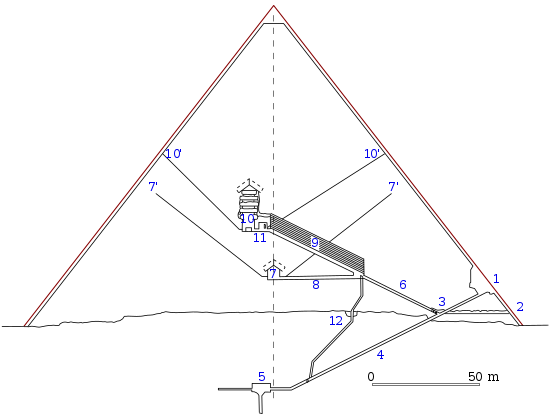

*Réponse publiée [sur Quora](https://fr.quora.com/Est-il-possible-d-atteindre-la-cime-des-pyramides-%C3%89gypte-depuis-l-int%C3%A9rieur-ou-l-ext%C3%A9rieur/answer/Dr-Goulu)*

pas depuis l'intérieur : elles sont pleines à l'exception de quelques pièces et couloirs, dont aucun ne mène au sommet

( [Chambres et couloirs de la pyramide de Khéops — Wikipédia](w:Chambres_et_couloirs_de_la_pyramide_de_Khéops) )

Et depuis l'extérieur c'est interdit pour raisons de sécurité et de préservation des sites

[https://observers.france24.com/f...](https://observers.france24.com/fr/20170123-escalader-pyramide-kheops-stupide-defi-touriste-turc)
