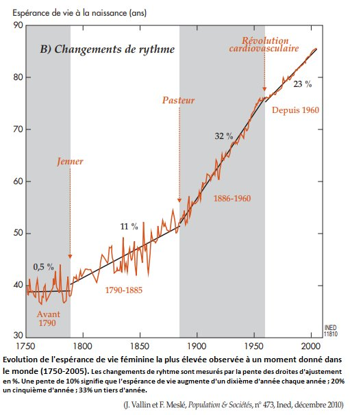

*Réponse publiée [sur Quora](https://fr.quora.com/La-m%C3%A9decine-actuelle-pourrait-elle-nous-mettre-tous-en-danger-par-son-approche-m%C3%A9caniciste-et-r%C3%A9ductionniste-de-la-conscience-ainsi-que-du-vivant/answer/Dr-Goulu)*

il n'y a que le résultat qui compte :

