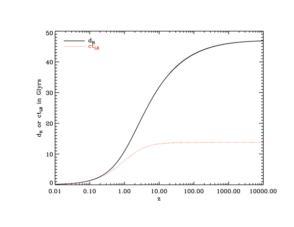

*Réponse publiée [sur Quora](https://fr.quora.com/Comment-fait-on-pour-d%C3%A9terminer-la-distance-r%C3%A9elle-actuelle-d-une-galaxie-lointaine-par-exemple-la-galaxie-GN-z11-%C3%A0-partir-du-d%C3%A9calage-vers-le-rouge-param%C3%A8tre-z/answer/Dr-Goulu)*

On utilise les équations découlant du [Modèle ΛCDM](w:)représentées dans la figure ci-dessous.

On y trouve en noir la distance actuelle de l'objet en fonction de z, en rouge la distance au moment de l'émission

[Redshift - Wikipedia](w:en:Redshift)
