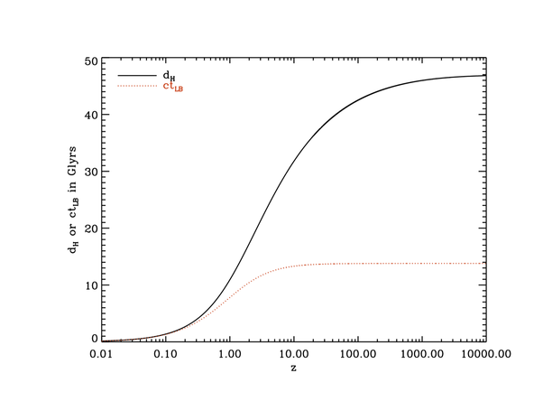

*Réponse publiée [sur Quora](https://fr.quora.com/Quelle-est-la-distance-en-ann%C3%A9es-lumi%C3%A8re-entre-notre-Galaxie-et-une-supernova-observ%C3%A9e-aujourd-hui-qui-a-explos%C3%A9-3-milliards-d-ann%C3%A9es-apr%C3%A8s-le-Big-Bang/answer/Dr-Goulu)*

Ca se calcule avec la courbe ci-dessous (ou les formules correspondantes) de la page [Redshift - Wikipedia](w:en:Redshift) , mais il faudrait le "z" caractérisant le décalage vers le rouge de votre supernova pour être précis.

Au pif, c'est la distance actuelle de l'[Horizon cosmologique](w:), 45 milliards d'années-lumière, moins 3*3 années lumière donc 36 année-lumière (et donc le z de votre supernova doit être environ = 15)

3*3 parce que l'Univers s'est grosso-modo dilaté d'un facteur 3 .

