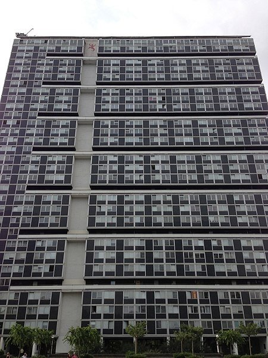

*Réponse publiée [sur Quora](https://fr.quora.com/%C3%80-quel-gratte-ciel-peut-on-comparer-la-tour-de-Babel-aujourd-hui/answer/Dr-Goulu)*

Les études archéologiques montrent qu'elle faisait 90 mètres de haut, ce qui est à peu près la limite pour une construction en briques.

[https://www.nationalgeographic.f...](https://www.nationalgeographic.fr/histoire/2021-08/mythe-tour-de-babel-ce-que-revele-archeologie)

A Genève on a la grande tour de la [Cité du Lignon](https://www.lignon.ch/fr/historique) construite en 1963 qui fait cette hauteur là.

Comparé à la Tour de Babel :

1. les 6500 habitants de la cité proviennent de 103 pays
2. il y a une piscine sur le toit.
