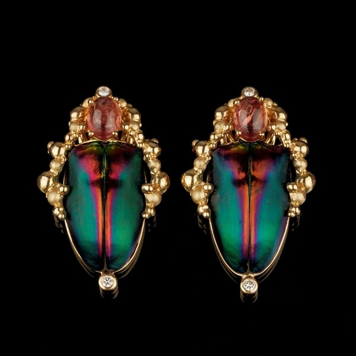
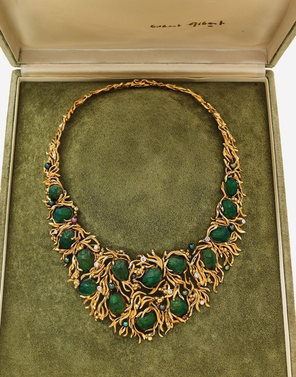

*Réponse publiée [sur Quora](https://fr.quora.com/Certains-insectes-peuvent-ils-devenir-des-sources-d-inspiration-pour-cr%C3%A9er-des-objets-artistiques-ou-d%C3%A9coratifs/answer/Dr-Goulu)*

[Gilbert Albert](w:)faisait de splendides bijoux en utilisant des scarabées

