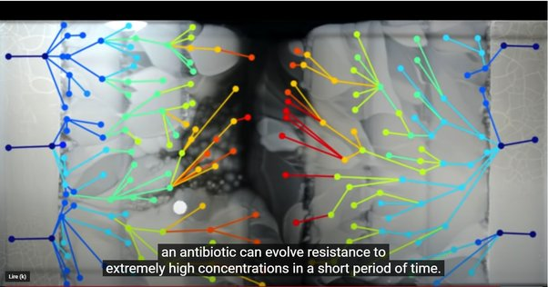

*Réponse publiée [sur Quora](https://fr.quora.com/Combien-de-temps-les-nouvelles-esp%C3%A8ces-mettent-elles-%C3%A0-%C3%A9voluer/answer/Dr-Goulu)*

Les espèces évoluent en permanence. Il n'y a pas de passage clair d'une espèce à une autre parce que, quasi par définition, vous êtes de la même espèce que vos parents.

Ce qui se passe, c'est que quand deux populations d'une même espèce sont séparées pendant "longtemps", elles évoluent chacune de leur côté en s'adaptant à leurs environnements respectifs jusqu'au point où les individus des deux populations ne peuvent plus se reproduire entre eux (ou plus exactement, leur "hybride" , s'il survit, est lui-même stérile).

On a donc pas une espèce qui évolue en une autre, mais une [Spéciation](w:)progressive d'une espèce en plusieurs sous-espèces, puis espèces.

Un bon moyen d'identifier des spéciations est d'examiner des [Hybrides](w:Hybride), naturels ou artificiels.

L'exemple le plus classique est le cheval et l'âne, dont l'hybride [Mulet](w:)est "statistiquement stérile", ce qui signifie que parfois, la compatibilité des deux ADN est encore suffisante pour que le mulet puisse se reproduire. Il n'est pas facile de dire combien de temps ça a pris car ces animaux se déplacent énormément et ont pu se rencontrer et s'hybrider joyeusement pendant longtemps, mais les estimations varient entre 400'000 ans et 2 millions d'années environ.

C'est à peu près le même ordre de grandeur pour nos plus proche cousins, les chimpanzés et les bonobos, qui ont été progressivement séparés par l'apparition du fleuve Congo il y a 1.5 à 2 millions d'années.

Mais comme l'évolution repose sur le mécanisme de la reproduction, il serait plus juste de compter en nombre de générations plutôt qu'en années. Comme les chevaux et les chimpanzés se reproduisent en moyenne autour de l'âge de 5 ans, la spéciation de ces grands mammifères prend donc des centaines de milliers de générations.

Donc elle ne prend "que" des centaines de milliers d'années pour les plantes et animaux qui se reproduisent chaque année, et des dizaines de milliers voire des milliers seulement pour des animaux qui ont un cycle de reproduction très rapide.

Le "[Moustique du métro de Londres](w:)" est un exemple de spéciation en cours d'un moustique qui s'adapte très rapidement à la vie dans les sous-sols de nos villes et qui ne peut déjà presque plus se reproduire avec un moustique de surface après 2 ou 3 siècles d'isolement.

Les bactéries se spécient encore plus vite, parfois en quelques jours seulement comme le montre cette [fantastique vidéo](https://www.youtube.com/watch?v=plVk4NVIUh8) qui illustre l'adaptation aux antibiotiques

[https://www.youtube.com/watch?v=...](https://www.youtube.com/watch?v=plVk4NVIUh8)

à la fin de la vidéo, cette image retrace l' "arbre généalogique" des mutations générées par l'expérience en quelques jours :

