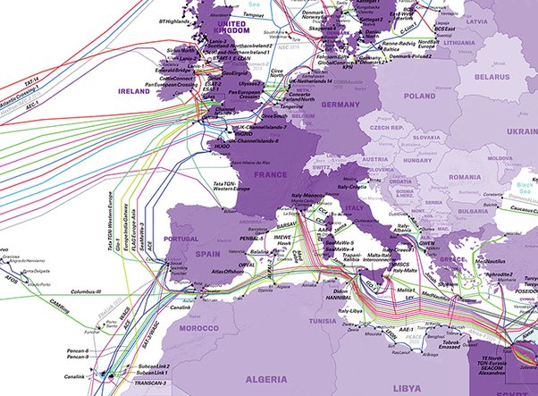

*Réponse publiée [sur Quora](https://fr.quora.com/Craignez-vous-un-sabotage-des-c%C3%A2bles-sous-marins-pour-internet-Et-du-coup-un-black-out-en-Europe/answer/Dr-Goulu)*

ça fait pas mal de câbles à couper, et mon petit doigt me dit que si un sous-marin arrive à en couper un, il se fera réduire en purée avant d'en couper un 2ème.
