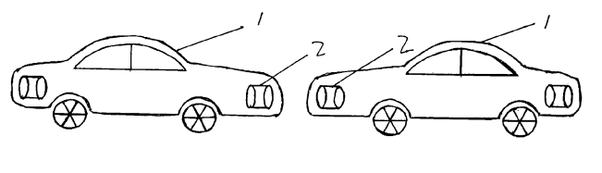

*Réponse publiée [sur Quora](https://fr.quora.com/Serait-il-possible-d-utiliser-des-aimants-suffisamment-puissants-int%C3%A9gr%C3%A9s-dans-les-carrosseries-de-2-voitures-avec-deux-p%C3%B4les-invers%C3%A9s-pour-limiter-les-accidents-de-la-route/answer/Dr-Goulu)*

ça m'intéresse de voir comment vous disposeriez les pôles … si vous jouez un peu à repousser un aimant avec un autre, vous verrez qu'ils ont une furieuse tendance à se retourner en une fraction de seconde pour venir plutôt se coller…

Avec les configurations auxquelles je pense, lors d'un carambolage une voiture sur deux fait un tête à queue pour se coller à la précédente et la suivante, soit elle fait un demi-tonneau pour faire de même, soit un bouchon sur plusieurs files forme un grosse boule de carcasses de bagnoles …

Mais par acquit de conscience, j'ai fait une petite recherche de brevet et ô surprise, il y en a un !

Chinois , de 2010, et sans aucun doute le brevet le plus court que j'aie jamais vu :

[https://patents.google.com/paten...](https://patents.google.com/patent/CN102398557A)

Et le dessin n'est pas le plus technique que j'aie vu non plus :

mais d'après ça, ce qui risque fort de se passer c'est qu'une voiture va passer au dessus de l'autre pour coller les pôles N/S de son capot avec les S/N de l'autre …

Bref désolé mais:

1. c'est déjà breveté
2. si c'était une bonne idée, ça existerait …
