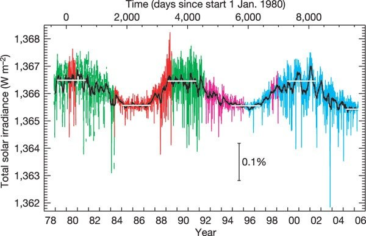
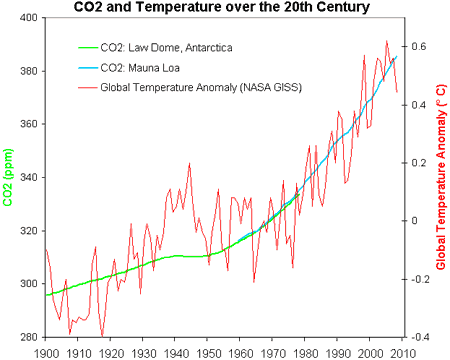

*Réponse publiée [sur Quora](https://fr.quora.com/Y-a-t-il-aussi-des-bouleversements-climatiques-sur-les-autres-plan%C3%A8tes-du-syst%C3%A8me-solaire/answer/Dr-Goulu)*

Non.

La [Grande Tache rouge](w:)et d'autres phénomènes météo sur Jupiter impliquent des surfaces/volumes plus importants que l'atmosphère terrestre, mas ce sont des phénomènes météorologiques à l'échelle de cette planète, pas climatiques.

Dans cet article[[1]](#EnxvK) vous trouverez les variations de la luminosité du Soleil mesurées par plusieurs engins spatiaux en plus de 40 ans:

Elle oscille de 0.1% avec le fameux [Cycle solaire](w:)de 11 ans mais ne montre pas le moindre signe de hausse, si c'était votre idée.

Le réchauffement climatique actuel a une et une seule cause : nous

( source : [The CO2/Temperature correlation over the 20th Century](https://skepticalscience.com/print.php?n=61) )

Notes de bas de page

[[1]](#cite-EnxvK)[https://www.researchgate.net/pub...](https://www.researchgate.net/publication/6818975_Variations_in_solar_luminosity_and_their_effect_on_the_Earth's_climate)
