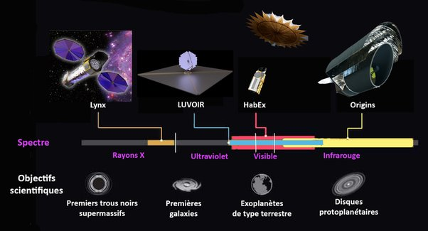

*Réponse publiée [sur Quora](https://fr.quora.com/Apr%C3%A8s-le-t%C3%A9lescope-spatial-James-Webb-quoi-dautre/answer/Dr-Goulu)*

Le projet du James Webb a commencé en 1989, et son espérance de vie est de 5.5 ans, donc vous pensez bien qu'il y a déjà de nombreux projets dans les pipelines …

En voici quelques uns, en commençant par les 4 projets de télescopes spatiaux de la NASA pour la décennie 2025–2035, avec lancement vers 2039 vers L2 (comme JWST)

- le [Large UV/Optical/Infrared Surveyor](w:) (LUVOIR) telescope optique de 15m (ou 8m dans la version low-cost)
- [Habitable Exoplanet Observatory](w:)(HabEx) de 4m avec coronographe pour observer directement les exoplanètes e
- L'[Observatoire rayons X Lynx](w:)
- L'[Origins Space Telescope](w:)

Ces 4 télescopes se complètent pour observer très finement un spectre très large, on peut les voir comme des successeurs du JWST

L'ESA n'est pas en reste avec le [Programme Cosmic Vision](w:)qui inclut notamment

- [Euclid, télescope spatial](w:Euclid_(télescope_spatial)) infrarouge, lancement en **2023**, qui devrait contribuer à mieux piger l'expansion de l'Univers par des mesures du [Cisaillement gravitationnel](w:)
- [PLATO, télescope spatial](w:PLATO_(télescope_spatial)) spécialisé en détection d'exoplanètes , lancement en 2026
- ARIEL ([Atmospheric Remote-Sensing Infrared Exoplanet Large-survey](w:)) télescope infrarouge spécialisé dans l'analyse de l'atmosphère des exoplanètes, lancement en 2028. Il va étudier 500 à 1000 planètes ayant une atmosphère en 4 ans, donc vers 2032 on devrait savoir quelle proportion de planètes "habitables" sont habitées par des organismes capables de photosynthèse.
- [ATHENA](w:), telescope spatial rayons X, lancement en 2031
- et bien sur [LISA](w:Laser_Interferometer_Space_Antenna)un détecteur d'ondes gravitationnelles à l'échelle du système solaire , constitué de 3 satellites qui mesureront la distance entre eux (environ 2.5 millions de km) à un diamètre de proton près. lancement en 2032

On est pas en reste au sol :

- dès 2025, mise en service des trois [Télescope géant européen](w:)(ELT) de 39 mètres à optique adaptative
- et bien d'autres

Donc vous voyez, il y a de nombreux projets de télescopes spatiaux après JWST, et il y en a d'ailleurs eu plusieurs entre Hubble et JWST, moins médiatiques mais scientifiquement tout aussi importants comme Planck, WMAP, Herschel , Spitzer et bien d'autres

[https://fr.wikipedia.org/wiki/T%...](w:Télescope_spatial)
