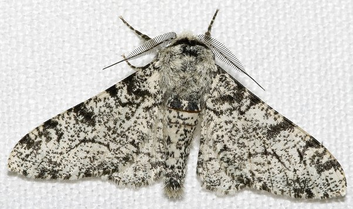
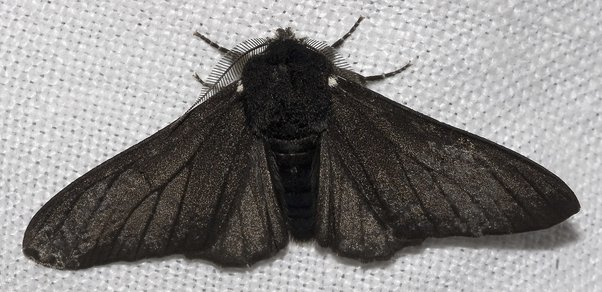

*Réponse publiée [sur Quora](https://fr.quora.com/Y-a-t-il-une-%C3%A9volution-chez-des-animaux-dont-l-homme-est-responsable/answer/Dr-Goulu)*

A part les animaux d'élevage mentionnés par d'autres, il y a un exemple spectaculaire souvent mentionné en cours de biologie évolutive : la [Phalène du bouleau](w:).

Comme son nom l'indique, ce papillon se pose volontiers sur des bouleaux, aux troncs naturellement blancs, et son camouflage est alors parfait :

Mais dans les régions fortement polluées, notamment à l'époque du charbon, les troncs ont noirci, les papillons blancs se sont fait plus facilement bouffer, et les plus sombres ont mieux survécu. Résultat après quelques dizaines de générations seulement , les phalènes du bouleau de ces régions ressemblent à ça :

Ce sont bien des papillons de la même espèce (toujours interféconds) mais adaptés à leur environnement.

Depuis les années 1960, avec la baisse de la pollution par le charbon en Europe et en Amérique du Nord, les phalènes redeviennent blanches.
