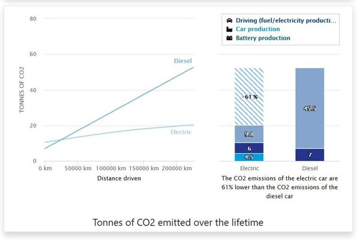

*Réponse publiée [sur Quora](https://fr.quora.com/Quel-v%C3%A9hicule-est-le-plus-%C3%A9cologique-ma-vielle-diesel-de-2005-%C3%A9quip%C3%A9e-d-un-filtre-%C3%A0-particules-ou-un-v%C3%A9hicule-%C3%A9lectrique-en-commande-qu-il-faudra-fabriquer/answer/Dr-Goulu)*

Si vous utilisez de l'électricité décarbonée pour charger votre véhicule, l'effet est très net : après 30'000km déjà votre bilan carbone est meilleur qu'avec un diesel et en fin de vie du véhicule (chez nous…) vous êtes 3x meilleur :

(source : [L’empreinte carbone de la voiture électrique largement inférieure à celle des véhicules thermiques - Avere-France](https://www.avere-france.org/lempreinte-carbone-de-la-voiture-electrique-largement-inferieure-a-celle-des-vehicules-thermiques/) )

Mais si votre vieux diesel continue roule encore 500'000 km en Afrique, vous ajoutez les deux courbes, voire pire.

Il ne faut pas se leurrer : ajouter un véhicule électrique sur les routes n'est pas "écologique", ça vous donne juste bonne conscience.

Pour être "écologique", il faut réduire le nombre de voitures thermiques, partout. Donc changez, mais mettez votre diesel à la casse.
