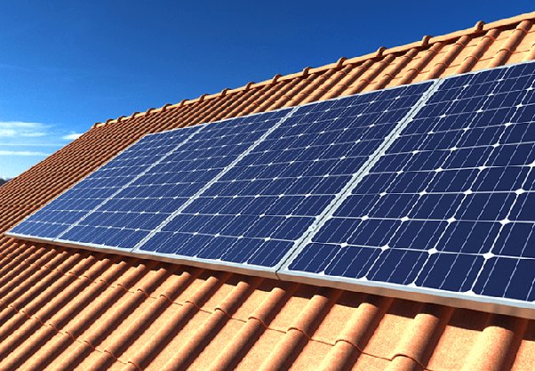

*Réponse publiée [sur Quora](https://fr.quora.com/Est-il-possible-de-cr%C3%A9er-de-l-%C3%A9lectricit%C3%A9-avec-d-autres-techniques-que-celle-du-diamant-qui-tourne-autour-de-la-bobine-de-cuivre-qui-est-encore-utilis%C3%A9e-dans-les-alternateurs-des/answer/Dr-Goulu)*

Oui

(photovoltaïque)
