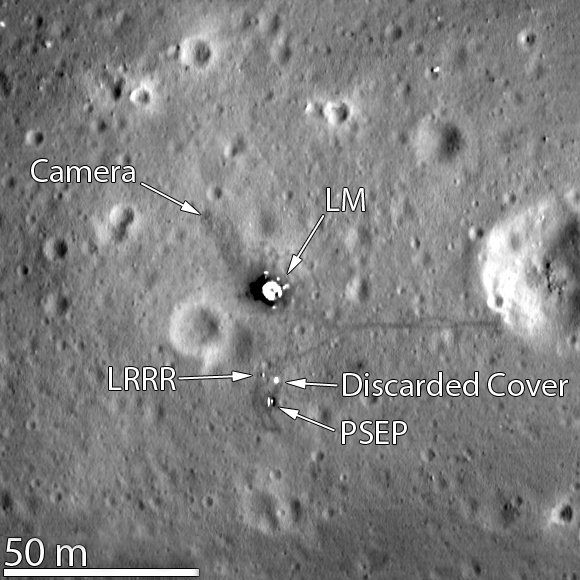

*Réponse publiée [sur Quora](https://fr.quora.com/Peut-on-observer-une-fus%C3%A9e-sur-la-lune-avec-des-jumelles-petit-t%C3%A9lescope/answer/Dr-Goulu)*

non, même avec un très gros télescope, et même avec les plus grands on ne peut pas voir quelque chose qui fait moins de 10 mètres sur la Lune.

Il faut observer depuis beaucoup plus près, ce qu'a fait la sonde [Lunar Reconnaissance Orbiter](w:) en 2009.

Elle a pris des images des différents sites d'alunissage comme celle-ci (site d'Apollo 11)

