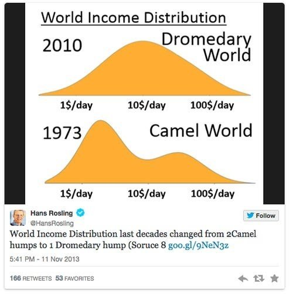

*Réponse publiée [sur Quora](https://fr.quora.com/Peut-on-envisager-la-croissance-ou-le-d%C3%A9veloppement-comme-facteur-de-correction-des-in%C3%A9galit%C3%A9s/answer/Dr-Goulu)*

Bien sur, et c'est exactement ce qui est en train d'arriver au niveau mondial. Un milliard de chinois, un milliard d'indiens et de plus en plus de sud américains et d'africains sont en croissance économique rapide et rattrapent le niveau de vie économique "occidental", ce qui produit une nette diminution des inégalités.

[https://ses.ens-lyon.fr/ressourc...](https://ses.ens-lyon.fr/ressources/stats-a-la-une/levolution-des-inegalites-mondiales-de-1870-a-2010)

Comme le montre Hans Rosling avec la distribution des revenus, on est passés d'un monde "chameau" à un monde "dromadaire"

