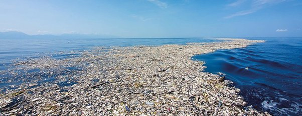
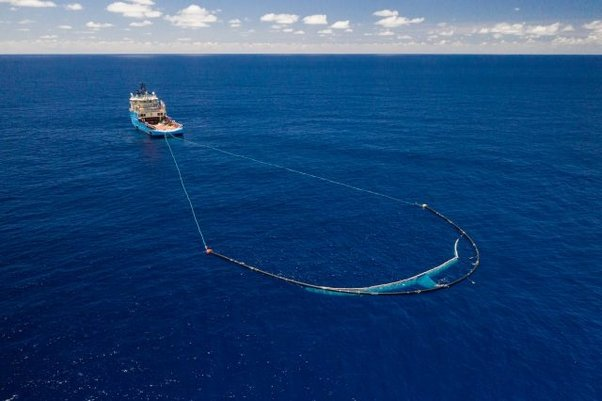

*Réponse publiée [sur Quora](https://fr.quora.com/Pourquoi-ne-voit-on-pas-de-photo-d-avion-ou-de-satellite-depuis-le-ciel-du-7e-continent-Les-plastiques-flottent-et-s-accumulent-par-les-courants-circulaires-de-l-oc%C3%A9an-Pacifique-De-telles/answer/Dr-Goulu)*

Ben parce qu'on le voit pas.

> Étant donné que la [mer de déchets](w:Déchet_en_mer) est [translucide](https://fr.wiktionary.org/wiki/translucide) et se situe juste sous la surface de l'eau, elle n'est pas détectable sur les photographies prises par des [satellites](w:Satellite_de_télédétection). Elle est seulement visible du pont des bateaux
>
>
>
> ([Vortex de déchets du Pacifique nord — Wikipédia](w:Vortex_de_déchets_du_Pacifique_nord))

Des images "éloquentes" comme celle-ci :

ne sont pas celles du continent de plastique (regardez bien, il y a des montagnes à l'horizon à gauche). Ce sont des déchets charriés à l'embouchure de rivières qui servent de décharge, par exemple ici au Honduras[[1]](#JVoGw) .

C'est dégueulasse, polluant et tout et tout, mais ce n'est pas le continent de plastique.

Le continent de plastique, ça ressemble plutôt à ça[[2]](#WmoeX) :

(image [Ocean Cleanup](https://theoceancleanup.com/) )

mais c'est moins "éloquent".

Il y a biens de millions de tonnes de plastique, là mais elles sont diluées dans des milliards de km3 d'eau.

C'est très grave, voire pire que le cas du haut parce que les déchets sont minuscules, parfois sous la surface de l'eau, et beaucoup plus difficiles à repêcher. Et hélas très peu visible.

Notes de bas de page

[[1]](#cite-JVoGw)[VIDEO. Caroline Power saisit les «îles de déchets» en images](https://www.20minutes.fr/insolite/2160991-20171031-video-honduras-photos-mer-plastique-choquent-defenseurs-environnement-internautes)

[[2]](#cite-WmoeX)[The Pacific Garbage Patch Is Probably Not What You Think It Is — Urban Seq](https://www.urbanseq.com/feed/the-pacific-garbage-patch-is-probably-not-what-you-think-it-is)
