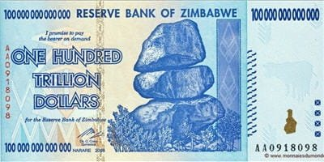

*Réponse publiée [sur Quora](https://fr.quora.com/Si-nous-%C3%A9tions-tous-milliardaires-quel-probl%C3%A8me-serait-le-plus-r%C3%A9curent/answer/Dr-Goulu)*

trouver une miche de pain à moins d'un million.

C'est ce qui est arrivé au Zimbabwe.

Ce billet de 100'000 milliards de [Dollar du Zimbabwe](w:)valait environ 30 dollars US quand il a été émis.

Plus que 10$ le lendemain.

Et plus que 3$ le surlendemain.

Le Zimbabwe a été le premier pays du monde où tout le monde était multi-milliardaire.

Ah mais vous vouliez dire milliardaire en une autre monnaie ? Laquelle ? Qu'est-ce qui vous fait croire qu'elle gardera sa valeur à long terme ?

[https://www.drgoulu.com/2009/04/...](/2009/04/03/combien-vaut-1-franc/)
