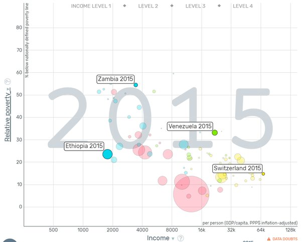

*Réponse publiée [sur Quora](https://fr.quora.com/Les-pays-qui-paraissent-les-plus-mis%C3%A9rables-sont-ceux-qui-comptent-en-r%C3%A9alit%C3%A9-le-moins-de-pauvres-%C3%A9crit-Tocqueville-au-XIX%C3%A8me-si%C3%A8cle-Comment-comprendre-ce-paradoxe-selon-lequel-plus-un/answer/Dr-Goulu)*

La première chose serait de vérifier si ce paradoxe existe.

Il y a des outils statistiques tres puissants pour vérifier ça. Mon préféré est le [Gapminder](https://www.gapminder.org/tools/#$chart-type=bubbles&url=v1)de feu Rosling.

Si vous tracez [le taux de pauvreté en fonction du revenu moyen par habitant](https://www.gapminder.org/tools/#$ui$chart$cursorMode=hand;;&model$markers$bubble$encoding$y$data$concept=alternative_poverty_percent_below_nationally_defined_poverty&space@=country&=time;;&scale$domain:null&zoomed@:2.29&:73.87;&type:null;;&x$scale$zoomed@:1343.82&:157922.5;;;&frame$value=2015;&trail$data$filter$markers$rus=2015&mex=2018&arg=2016&zmb=2015&che=2015&eth=2015&ven=2015;;;;;;;;&chart-type=bubbles&url=v1) de chaque pays (données 2015 parce que les plus récentes ne sont pas encore disponibles) vous obtenez ça:

Vous voyez que les pays pauvres ont beaucoup plus de pauvres que les riches.

Ou alors vous pensiez à d'autres valeurs selon les deux axes ? Cherchez : Gapminder en a une bonne centaine.

Tocqueville avait déjà probablement tort car je ne crois pas que Gapminder fonctionnait à son époque mais aujourd'hui c'est clair : ce paradoxe n'existe pas.

Comme dit dans d'autres réponses, la solidarité familiale marche mieux dans certains pays (Éthiopie) où la pauvreté est enracinée depuis des générations, du moins ceux ou l'état n'a pas les moyens de fournir une protection sociale, ou la détourne au profit de quelques uns (Zambie, Venezuela)

Mais ça marche moins bien que l état social des pays européens (points jaunes) ou le plein emploi du à une croissance économique (Asie, en rouge)
