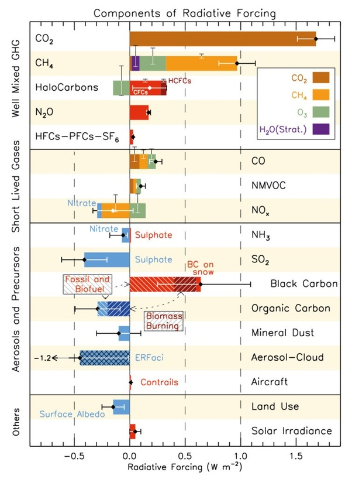

*Réponse publiée [sur Quora](https://fr.quora.com/Pensez-vous-que-le-r%C3%A9chauffement-climatique-puisse-%C3%AAtre-d-origine-cyclique-et-naturelle-et-non-imputable-enti%C3%A8rement-%C3%A0-l-activit%C3%A9-humaine/answer/Dr-Goulu)*

Ce que je pense n'a aucune importance.

De nombreux travaux scientifiques évaluent depuis longtemps toutes les causes "cycliques et naturelles" possibles.

La seule qui ne soit pas négligeable est l'[Irradiation solaire](w:). L'activité solaire peut varier de 0.1% environ en fonction des cycles solaires, de l'orbite terrestre (les fameux [Cycles de Milankovitch](https://planet-terre.ens-lyon.fr/ressource/milankovitch.xml)) etc.

En 2007 [Cette figure du rapport du GIEC](https://archive.ipcc.ch/publications_and_data/ar4/wg1/fr/figure-spm-2.html) chiffrait le "forçage radiatif" naturel entre 0.06 et 0.30 W/m2 et celui du aux activités humaines (y compris l'émission d'aérosols qui ont un effet de refroidissement) était évaluée entre 0.6 et 2.4 W/m2. Donc y'avait pas photo.

Je viens de trouver cette figure mise à jour dans le rapport de 2013[[1]](#aqNSL)

La variation d'irradiance solaire a été ré estimée entre 0 et 0.10 W/m2 et celle de l'activité humaine entre 1.1 et 3.3 W/m2 entre 1750 et 2011.

Donc y'a encore moins photo.

Et pour ceux qui vont dire "ouaismaisçacéleGIECquidit", vous avez la liste des ~500 articles scientifiques utilisées pour produire cette figure et les 7 pages de tableaux de données à la fin de la référence ci-dessous.

Notes de bas de page

[[1]](#cite-aqNSL)[https://www.ipcc.ch/site/assets/...](https://www.ipcc.ch/site/assets/uploads/2018/02/WG1AR5_Chapter08_FINAL.pdf)
