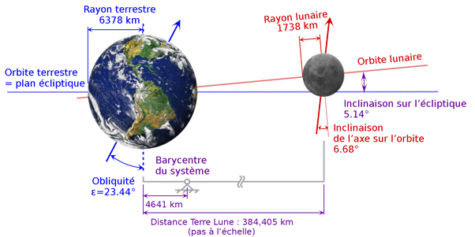

*Réponse publiée [sur Quora](https://fr.quora.com/Quel-est-l-endroit-le-plus-pratique-pour-installer-des-panneaux-solaires-sur-la-lune-afin-de-produire-autant-d-%C3%A9lectricit%C3%A9-que-possible-pour-une-colonie-lunaire/answer/Dr-Goulu)*

le problème du solaire sur la Lune, c'est que vous en avez pendant 14 jours, et puis plus pendant 14 jours…

Donc si vous avez un gros moyen de stockage pour votre "colonie", alors c'est comme sur Terre à l'équateur que vos panneaux recevront la lumière presque perpendiculairement un jour par mois

Peut-être que des panneaux orientables près d'un pôle permettraient d'avoir du jus plus longtemps, donc avec un plus petit stockage, sans souffrir de l'épaisseur de l' atmosphère comme sur Terre

