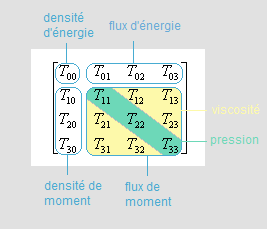

*Réponse publiée [sur Quora](https://fr.quora.com/L-%C3%A9quation-d-Einstein-est-elle-vraiment-utilis%C3%A9e-%C3%A0-quoi-correspond-le-r%C3%A9sultat-de-cette-%C3%A9quation-et-quelle-est-la-dimension-du-r%C3%A9sultat/answer/Dr-Goulu)*

Laquelle ?

$e=m.c^2$ ? elle n'est pas utilisée directement à ma connaissance mais se retrouve indirectement partout, dont plus bas. La dimension ? Vous voulez dire les unités ? Ces sont des [Joules](w:Joule) à gauche du signe égal, et des $\mathrm{kg.m2/s^2}$ à droite, donc des joules aussi.

"ça joule" comme on dit chez nous …

Ou vous pensiez plutôt à

$$R_{{\mu \nu }}\ -\ {\frac  {1}{2}}\,g_{{\mu \nu }}\,R\ +\ \Lambda \ g_{{\mu \nu }}\ =\kappa T_{{\mu \nu }}$$

qui est ce qu'on appelle plutôt l'[Équation d'Einstein](w:)?

Elle est utilisée un max en cosmologie théorique ou pour simuler des trous noirs, des galaxies et autres univers dans des superordinateurs.

Là les termes à gauche sont des tenseurs de dimension $\mathrm{1/m^2}$ C'est cette dimension qui conduit à parler de "courbure" de l'espace-temps.

à droite, vous avez le [Tenseur énergie-impulsion](w:) qui a la dimension (énergie y compris $m.c^2$)/volume selon cette forme:

donc vous avez des $\mathrm{J/m^3}$ multipliés par la [Constante d'Einstein](w:)en $\mathrm{m/J}$, et vous obtenez bien des $\mathrm{1/m^2}$ comme à gauche.
