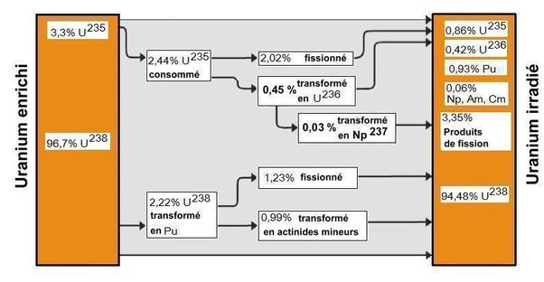

*Réponse publiée [sur Quora](https://fr.quora.com/Combien-faut-il-mettre-de-kilos-d-uranium-dans-r%C3%A9acteur-nucl%C3%A9aire-pour-que-le-r%C3%A9acteur-produise-1-kilo-de-plutonium/answer/Dr-Goulu)*

Environ 107kg

