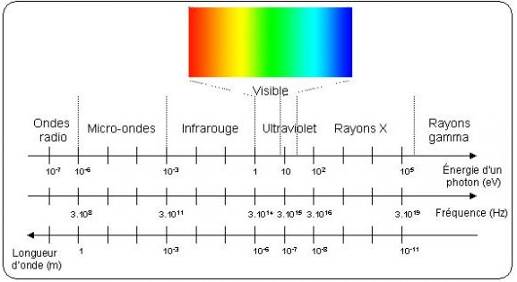

*Réponse publiée [sur Quora](https://fr.quora.com/Dans-un-r%C3%A9seau-%C3%A9lectrique-incluant-2-r%C3%A9sidences-branch%C3%A9es-en-parall%C3%A8le-sur-le-m%C3%AAme-transformateur-est-ce-quune-boucle-de-masse-engendr%C3%A9e-par-une-terre-partag%C3%A9e-peut-rendre-ionisante/answer/Dr-Goulu)*

Non.

Une "onde ionisante", c'est un photon de rayon X ayant une énergie de l'ordre de 100eV minimum, donc une longueur d'onde de l'ordre de 10 nanomètres.

C'est un milliard de fois plus énergétique qu'une onde radio, un million de fois plus qu'une micro-onde.

Et entre les deux il y a le spectre visible, donc quand l'espace entre vos deux résidences deviendra lumineux, là vous pourrez re-poser la question.

Si une boucle de masse (qui [n'est pas ce que vous croyez](w:Boucle_de_masse) d'après votre question) pouvait faire ça, vous n'auriez pas besoin de transformateur pour alimenter votre maison et on réécrirait toute la physique.
