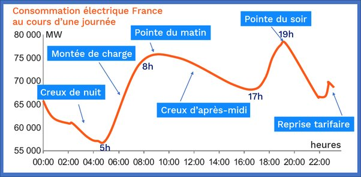

*Réponse publiée [sur Quora](https://fr.quora.com/Imaginons-que-l%C3%A9lectricit%C3%A9-en-France-soit-produite-%C3%A0-50-par-du-nucl%C3%A9aire-et-%C3%A0-50-par-du-renouvelable-de-combien-de-TWh-faudrait-il-augmenter-nos-capacit%C3%A9s-de-stockage-pour-passer-les/answer/Dr-Goulu)*

Ca dépend beaucoup d'un facteur que vous n'avez pas mentionné : quel risque de coupure d'approvisionnement (ou de dépendance de l'étranger pour l'éviter) acceptez-vous ?

Si vous n'en acceptez aucun, ce qui est à peu près la situation actuelle, vous ne pouvez pas compter sur l'éolien. Il est trop aléatoire, il peut y avoir des semaines sans vent. Donc vous ne pouvez compter que sur le solaire, parce qu'il est bien prévisible : il y aura du soleil tous les jours, et une couverture nuageuse ne réduit le rendement des panneaux "que" de 30 à 50%.

Et les 50%… en puissance installée ou en énergie produite ?

parce qu'actuellement vous avez 60 GW de puissance nucléaire installée, mais à cause d'un facteur de charge de 68% seulement vous ne produisez que 41GW en moyenne

mais en solaire ça fait une énorme différence parce que le [Facteur de charge](w:Facteur_de_charge_(électricité)) du solaire en France n'est que de 13.5% sur l'année, donc pour produire 41 GW de moyenne il faudrait 300 GW de puissance installée …

Donc si vous prenez la courbe de consommation typique d'une journée en France:

vous voyez que si vous superposez l'addition d'une constante à 41 GW avec un bout de sinusoïdale qui part de 0 à 6h du matin, monte à 300 GW à midi (disons 150 en hiver par temps couvert) et redescend à 0 vers 18h
