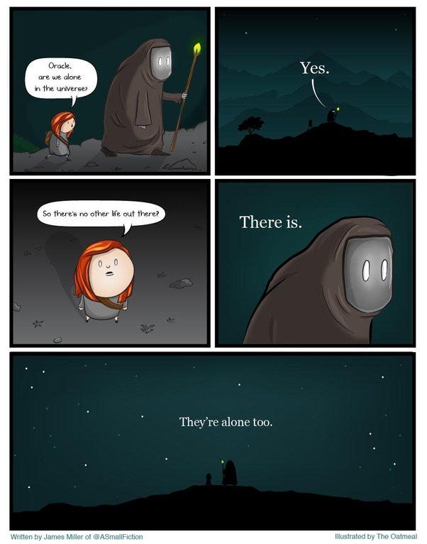

*Réponse publiée [sur Quora](https://fr.quora.com/Pourquoi-l-univers-n-est-il-pas-rempli-de-vie/answer/Dr-Goulu)*

A cause du Grand Filtre.

[https://www.drgoulu.com/2012/12/...](/2012/12/28/le-grand-filtre/)

mais nous ne savons pas encore où il est.

S'il est derrière nous (origine de la vie / multicellulaire / intelligente) alors la vie est très rare.

S'il est devant nous (voyage interstellaire) alors il y a beaucoup de vies séparées par des distances infranchissables qui les isolent à jamais.

J'aime BEAUCOUP ce cartoon (merci à celui/celle qui me l'a fait découvrir sur Quora, je ne sais plus qui c'est…)

