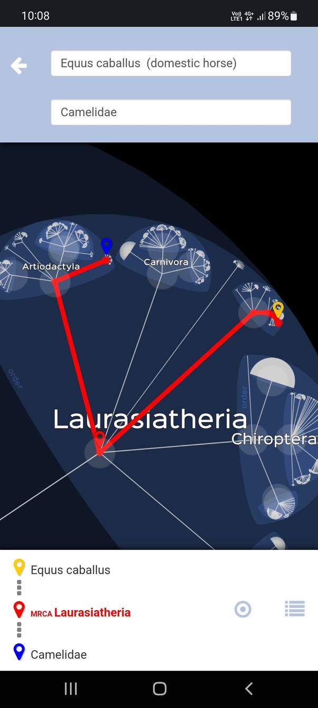

*Réponse publiée [sur Quora](https://fr.quora.com/Quelle-est-la-relation-%C3%A9volutive-entre-les-chameaux-et-les-chevaux-Ont-ils-un-anc%C3%AAtre-commun-et-si-oui-lequel/answer/Dr-Goulu)*

[Lifemap](http://lifemap.univ-lyon1.fr/mobile.index.html)est votre ami.

Tous les êtres vivants ont un ancêtre commun, entre les chevaux et les chameaux il faut remonter aux[Laurasiatheria](w:)il y a 76 à 90 millions d'années donc "encore" à l'epoq
