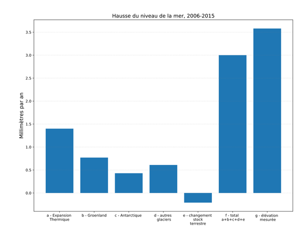

*Réponse publiée [sur Quora](https://fr.quora.com/Qu-est-ce-qui-est-%C3%A0-l-origine-de-l-%C3%A9l%C3%A9vation-du-niveau-de-la-mer/answer/Dr-Goulu)*

par ordre d'importance :

1. L'expansion thermique de l'eau (= dilatation)
2. La fonte des glaciers du Groenland
3. La fonte des autres glaciers
4. La fonte de l'Antarctique

tous les 4 étant du au réchauffement climatique,

lui-même étant dus à **nos émissions de "gaz à effet de serre"**.

[Élévation du niveau de la mer — Wikipédia](w:Élévation_du_niveau_de_la_mer)

