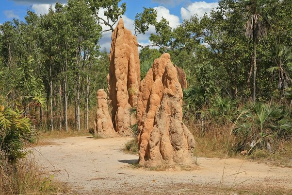

*Réponse publiée [sur Quora](https://fr.quora.com/Comment-les-humains-peuvent-ils-apprendre-%C3%A0-coexister-en-harmonie-avec-d-autres-esp%C3%A8ces-animales-et-v%C3%A9g%C3%A9tales/answer/Dr-Goulu)*

L'harmonie, ça n'existe pas dans la nature.

Aucune espèce ne vit "en harmonie" avec d'autres. Elle les bouffe et se fait bouffer, et se reproduit au maximum entre deux.

Les coraux se battent entre eux, les arbres poussent le plus vite possible pour enlever la lumière aux autres, les termites désertifient tout autour de leurs cités

Nous ne faisons pas exception, nous suivons la règle. Si j'étais croyant je dirais même la règle divine :

> Croissez, et multipliez, et remplissez la terre; et l'assujettissez, et dominez sur les poissons de la mer, et sur les oiseaux des cieux, et sur toute bête qui se meut sur la terre.

On a fait exactement ça. Mission accomplished.

Maintenant, si vous voulez vivre "en harmonie", alors c'est assez simple.

Le PIB/habitant moyen mondial est de $11'000 par an. Il correspond à ce que l'humain moyen consomme et pollue. Mais l'humanité consomme environ 6x plus que ce qui serait la limite de la durabilité. Donc il ne faudrait consommer que l'équivalent de $2000 par an environ pour être "durables".

Alors vous prenez [Liste des pays par PIB (PPA) par habitant](w:)(PPA ça veut dire "parité de pouvoir d'achat", donc on tient compte des différences de prix entre pays là dedans) et vous scrollez vers le bas, vous scrollez encore et encore jusqu'à trouver le premier pays dans lequel les gens vivent avec moins de $2000 par an, et vous trouvez suivant les classements le Tchad, la Guinée, le Burkina Faso ou l'Afghanistan.

Voilà, vous allez là-bas et vous vivez comme des gens moyens là-bas, et là vous serez "en harmonie" …

Bon, ok, il y a aussi les [Kiribati](w:), ça fait plus envie, mais leurs îles vont bientôt être sous l'eau alors ils pensent déménager aux Fidji, $9000 de PIB/habitant, donc adieu la durabilité et l'harmonie.
