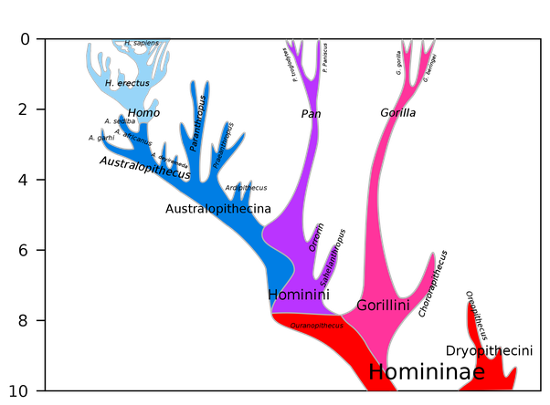

*Réponse publiée [sur Quora](https://fr.quora.com/Quel-singe-se-rapproche-le-plus-de-l-homme/answer/Dr-Goulu)*

on a coutume de dire que c'est le [Bonobo](w:)à cause de ses comportement sociaux, mais génétiquement nos cousins les plus proches sont les deux espèces du [genre Pan, le chimpanzé](w:Chimpanzé) et le Bonobo.

La spéciation entre ces deux espèces remonte à 1 million d'années environ, quand le fleuve Congo a séparé les deux populations, alors que la séparation de la [lignée humaine](w:Histoire_évolutive_de_la_lignée_humaine) date de 5 millions d'années à la louche.

