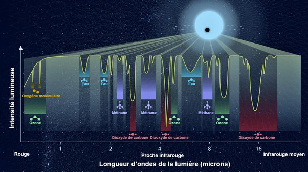
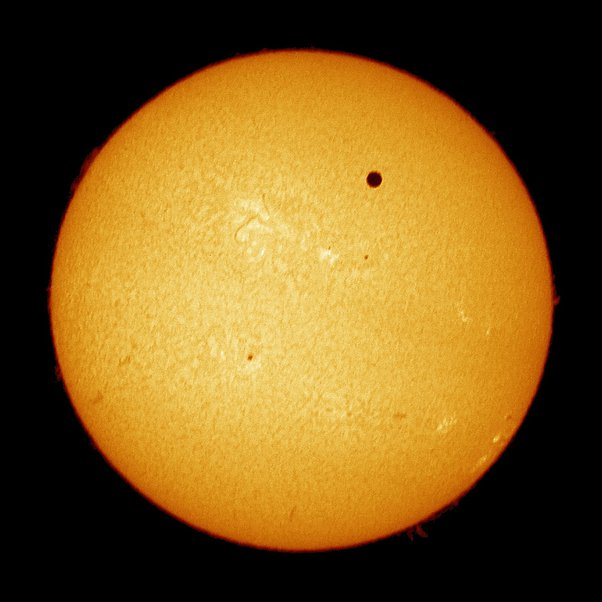

*Réponse publiée [sur Quora](https://fr.quora.com/Comment-mesurons-nous-la-quantit%C3%A9-de-O2-des-exoplan%C3%A8tes/answer/Dr-Goulu)*

Pour l'instant on a pas les instruments capables de le faire, à part [le télescope spatial James-Webb](w:James-Webb_(télescope_spatial)), mais ce n'est pas sa mission principale.

On lancera bientôt des télescopes spécialisés pour ceci.

Le premier sera européen : ARIEL ([Atmospheric Remote-Sensing Infrared Exoplanet Large-survey](w:)) en 2028.

La NASA a renoncé à son projet similaire FINESSE ([Fast Infrared Exoplanet Spectroscopy Survey Explorer](w:)) mais je crois me souvenir qu'ils en ont un autre pour les années 2030 que je ne retrouve plus.

Le principe de la mesure est de détecter les raies d'absorption due à l'oxygène moléculaire O2 (dans le rouge, à gauche de la figure ci-dessous) dans le spectre de l'étoile lorsque la planète passe devant…

Sachant qu'un transit de planète devant une étoile ressemble plutôt à ça

(transit de Venus devant le Soleil en 2012) vous imaginez la précision des spectromètres nécessaires …
