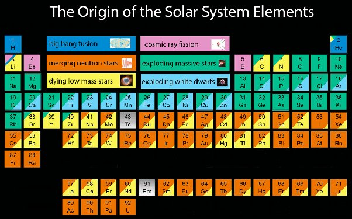

*Réponse publiée [sur Quora](https://fr.quora.com/Quel-%C3%A9l%C3%A9ment-du-tableau-p%C3%A9riodique-de-Mendele%C3%AFev-met-des-millions-d-ann%C3%A9es-%C3%A0-se-former-et-quel-autre-%C3%A9l%C3%A9ment-ne-dure-qu-une-fraction-de-seconde/answer/Dr-Goulu)*

Tous les éléments se forment en une minuscule fraction de seconde, lors de la fusion dans les étoiles ou la fission d'éléments lourds formés dans des événements cataclysmiques.

Ce tableau périodique montre la provenance des différents éléments

On y voit

- En Bleu : seuls l'hydrogène et l'hélium ont été produits lors du Big Bang
- Vert foncé : les éléments libérés dans l'espace lors d'explosions d’étoiles massives. On peut supposer que ça a été les suivants dans l'ordre chronologique parce que les grosses étoiles ont une courte durée de vie
- Jaune : les suivants ont été ceux libérés lors de la mort d’étoiles de masse faible, de durée de vie plus longue (milliards d'années)
- Orange : fusions d’étoiles à neutrons. Pour ça il faut des étoiles à neutrons, rémanents de supernova, et qu'elles se rencontrent. Ces éléments ont été produits "tard"
- Bleu clair : idem. Les explosions de naines blanches ne se produisent que longtemps après la mort des étoiles de masse faible qui leurs donnent naissance.
- Rose : le beryllium et le bore sont produits par spalliation d'atomes plus lourds par des rayons cosmiques. Je ne sais pas quand*.*

Les éléments actuels (et définitifs) sont donc le résultat de plusieurs générations d'étoiles et de leurs interactions.

Il a fallu 13.8 milliards d'années pour produire 2% d'autre chose que de l'hydrogène ou de l'hélium.

[https://fr.wikipedia.org/wiki/Ab...](w:Abondance_des_éléments_chimiques)
