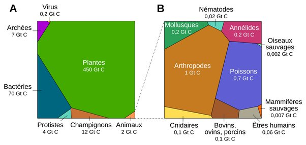

*Réponse publiée [sur Quora](https://fr.quora.com/Qu-est-ce-qui-d%C3%A9finit-la-vie-et-comment-pouvons-nous-savoir-si-d-autres-formes-de-vie-existent-ailleurs-dans-l-univers/answer/Dr-Goulu)*

C'est très difficile de définir la vie. J'aime bien ce qu'en disait

> [Claude Bernard](w:), dans la première des *Leçons sur les phénomènes de la vie communs aux animaux et aux végétaux* (1878), déclare explicitement que l'on n'a pas à se soucier de la notion de vie, car la biologie doit être une science expérimentale et n'a donc pas à donner une définition de la vie ; ce serait là une définition *a priori* et
>
>
>
> « **la méthode qui consiste à définir et à tout déduire d'une définition peut convenir aux sciences de l'esprit, mais elle est contraire à l'esprit même des sciences expérimentales** ».
>
>
>
> En conséquence, « il suffit que l'on s'entende sur le mot vie pour l'employer » et « il est illusoire et chimérique, contraire à l'esprit même de la science, d'en chercher une définition absolue ».
>
>
>
> ([Vie — Wikipédia](w:Vie))

Mais bon, si on retient la "définition" moderne

> La principale caractéristique d’un être vivant, par rapport aux objets inanimés et aux machines, est qu’il est « un corps qui forme lui-même sa propre substance » à partir de celle qu’il puise dans le milieu.

Alors le seul moyen de détecter de la vie à distance est de détecter la consommation de matière ou le dégagement de déchets résultant de la vie.

Avec la biochimie basée sur le carbone et l'eau que nous connaissons sur Terre et qui semble beaucoup plus probable que d'autres [Biochimies hypothétiques](w:), la matière consommée est du carbone sous forme de CO2, et le déchet produit est un gaz hautement réactif qui peut difficilement subsister en quantité importantes à la suite de processus purement chimiques : l'oxygène, plus précisément le dioxygène O2.

Je sais, là on a un gros problème parce que le niveau de CO2 a augmenté de 0.1% en un siècle, mais êtres vivants détectables sur Terre, ce sont les plantes, pas nous les animaux:

([La répartition de la biomasse sur Terre](https://planet-vie.ens.fr/thematiques/ecologie/relations-trophiques/la-repartition-de-la-biomasse-sur-terre) ENS Lyon )

Donc si on détecte plus de 10% d'oxygène dans l'atmosphère d'une planète en "zone habitable", donc avec de l'eau liquide, et relativement peu de CO2 on aura un très fort indice de présence de vie.

Oui, c'est très lié à la vie telle que nous connaissons sur Terre, mais nous avons de plus en plus de raisons de penser que cette forme de vie est la moins exceptionnelle, et nous n'avons pas les moyens de détecter les autres.

Par contre nous commençons à avoir les moyens de mesurer la quantité de CO2, d'H2O et d'O2 dans les atmosphère d'exoplanètes. D'ici quelques années nous aurons des instruments spécialisés comme ARIEL ([Atmospheric Remote-Sensing Infrared Exoplanet Large-survey](w:)) qui sera lancé en 2028.

Après les premiers pas sur la Lune, j'espère vivre la détection de la vie extraterrestre dans une décennie ou deux.

[https://www.unige.ch/campus/nume...](https://www.unige.ch/campus/numeros/119/dossier5/)
