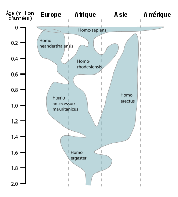

---

title: Alors que nous étions encore en Afrique, les Néandertaliens vivaient en Europe, au Moyen-Orient et en Asie centrale depuis environ 400 000 ans. Pourquoi nous, Homo sapiens avons-nous mis si longtemps pour migrer hors d'Afrique ?
slug: alors-que-nous-etions-encore-en-afrique-les-neandertaliens-vivaient-en-europe-au-moyen-orient-et-en-asie-centrale-depuis-environ-400-000-ans-pourquoi-nous-homo-sapiens-avons-nous-mis-si-longtemps-pour-migrer-hors-d-afrique
date: '2022-01-22'
draft: true
categories:
- Pourquoi
tags: []
coverImage: ./images/qimg-9ecf1a5bafba7dcefd91d38eac6ec351.png
---

*Réponse publiée [sur Quora](https://fr.quora.com/Alors-que-nous-%C3%A9tions-encore-en-Afrique-les-N%C3%A9andertaliens-vivaient-en-Europe-au-Moyen-Orient-et-en-Asie-centrale-depuis-environ-400-000-ans-Pourquoi-nous-Homo-sapiens-avons-nous-mis-si/answer/Dr-Goulu)*

On était bien en Afrique :-)

Il y a eu plusieurs [Sorties d'Afrique](https://www.hominides.com/html/dossiers/sortie-d-afrique.php), certaines il y a 2 millions d'années déjà.

Neandertal était un cousin récent, comme Denisova, mais beaucoup d'Homo avaient colonisé l'Asie bien avant, formant des espèces comme erectus qui a disparu avec l'arrivée de Sapiens …

([Homo — Wikipédia](w:Homo) )
