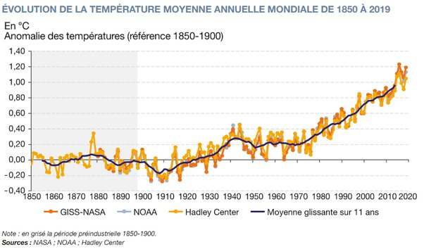

---

title: Comment la ville de Paris, qui a connu un nombre croissant d'épisodes de pollution aux particules fines, peut-elle être crédible en tant que porte-drapeau de la lutte contre le changement climatique ?
slug: comment-la-ville-de-paris-qui-a-connu-un-nombre-croissant-d-episodes-de-pollution-aux-particules-fines-peut-elle-etre-credible-en-tant-que-porte-drapeau-de-la-lutte-contre-le-changement-climatique
date: '2022-08-30'
draft: true
categories:
- Comment
tags: []
coverImage: ./images/qimg-d4a956cab9c1a99d7469048341605677.jpg
---

*Réponse publiée [sur Quora](https://fr.quora.com/Comment-la-ville-de-Paris-qui-a-connu-un-nombre-croissant-d-%C3%A9pisodes-de-pollution-aux-particules-fines-peut-elle-%C3%AAtre-cr%C3%A9dible-en-tant-que-porte-drapeau-de-la-lutte-contre-le-changement/answer/Dr-Goulu)*

> En moyenne, les aérosols ont en un effet parasol s’opposant à l’effet de serre.
>
>
>
> ([Lettre PIGB 14 - Aérosols et climat](https://web.archive.org/web/20211209134601/https://www.cnrs.fr/cw/dossiers/dosclim1/biblio/pigb14/02_aerosols.htm) - CNRS )

(autre référence : [Les aérosols et le climat](https://web.archive.org/web/20220808190224/https://www.meteosuisse.admin.ch/home/climat/changement-climatique-suisse/les-aerosols-et-le-climat.html) - Meteo Suisse)

On sait maintenant que l'émission de particules fines, notamment soufrées, à joué un rôle dans le "plateau" du réchauffement entre 1940 et 1970.

On constate d'ailleurs aussi de légers refroidissement après de grosses éruptions volcaniques.

Certains proposent même d'émettre des aérosols au cas où le réchauffement deviendrait trop catastrophique, voir [Géoingénierie solaire — Wikipédia](w:Géoingénierie_solaire) .

Bref, de ce point de vue Paris est parfaitement cohérente…
