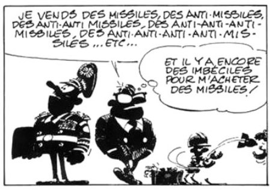

*Réponse publiée [sur Quora](https://fr.quora.com/Comment-r%C3%A9agit-une-grande-puissance-face-%C3%A0-une-attaque-nucl%C3%A9aire-Existe-t-il-des-syst%C3%A8mes-pour-intercepter-de-telles-armes/answer/Dr-Goulu)*

Oui bien sur. voir

[Défense antimissile des États-Unis](w:Défense_antimissile_des_États-Unis)

les russes et les chinois ont certainement un équivalent.

La réponse a été de développer le [Mirvage](w:): un même missile largue plusieurs têtes nucléaires avant qu'il puisse être intercepté. …

([idées noires de Franquin](w:Idées_noires_(bande_dessinée))… une perle !)
