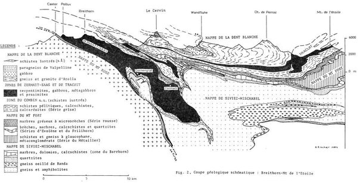

*Réponse publiée [sur Quora](https://fr.quora.com/Comment-tous-les-fossiles-de-vie-marine-au-sommet-des-montagnes-s-int%C3%A8grent-ils-dans-la-colonne-g%C3%A9ologique-pr%C3%A9sent%C3%A9e-par-la-th%C3%A9orie-de-l-%C3%A9volution/answer/Dr-Goulu)*

Je n'avais jamais entendu parler de "colonne géologique", alors j'ai cherché et ne l'ai trouvée que sur des sites créationnistes… Comme je ne recule devant aucun sacrifice, j'en ai parcouru plusieurs et ça à l'air d'un mix simpliste entre les notions de [colonne stratigraphique](w:Log_géologique)et d'[échelle des temps géologiques](w:).

Apparemment c'est l'idée du 19ème siècle selon laquelle les sédiments se déposent gentiment les uns sur les autres et forment de belles couches bien régulières qui restent là ad vitam eternam.

Evidemment, dans ce contexte, ce qu'on trouve en surface est forcément récent …

Mais figurez-vous qu'on a compris deux ou trois choses en géologie depuis le 19ème siècle, notamment:

1. que les continents bougent latéralement, et on peut même mesurer leur mouvement par satellite : ils bougent de plusieurs centimètres par an.
2. quand ces plaques tectoniques se rencontrent, une passe carrément au dessus de l'autres en formant :
3. tout ça forme des chaines de montagne qui grandissent de plusieurs millimètres par année. Plusieurs mètres par millénaire. Plusieurs kilomètres par million d'années …
4. à tel point qu'en fait les chaînes de montagne devraient toutes être beaucoup plus hautes que l'Himalaya, et le rester s'il n'y avait pas l'[Érosion](w:) qui supprime lentement mais surement les couches supérieures.

Avec tout ça, à la faveur de l'érosion, vous pouvez retrouver des roches de quasiment n'importe quel âge en surface.

Voici par exemple une coupe géologique de la région du Cervin (dans les Alpes suisse…) où vous voyez au moins 5 nappes d'une douzaine de roches totalement différentes sur une trentaine de kilomètres.

Les pointillés "en l'air" montrent le niveau des couches érodées, dont vous retrouvez le sable dans la vallée du Rhône jusqu'à Marseille.

En passant, le dessin est l'œuvre d'Arthur Escher, le fils du peintre dont je viens de causer dans une autre réponse, coïncidence …

Si comme moi vous êtes nul en géologie mais voulez vous soigner, je vous recommande vivement ce bouquin :

[Michel Marthaler](https://web.archive.org/web/20260420003438/http://openlibrary.org/authors/OL4091155A/Michel_Marthaler) "[Le Cervin est-il africain ?: Une histoire géologique entre les Alpes et notre planète](https://web.archive.org/web/20260420004055/http://openlibrary.org/books/OL25209065M/Le_Cervin_est-il_africain)" (2005) LEP ISBN:9782606011543 [WorldCat](http://worldcat.org/isbn/9782606011543) [Google Books](http://books.google.com/books?as_isbn=9782606011543) [disponible auprès de l’éditeur](https://web.archive.org/web/20161018135949/http://www.editionslep.ch/detail.php?lep=920119)
